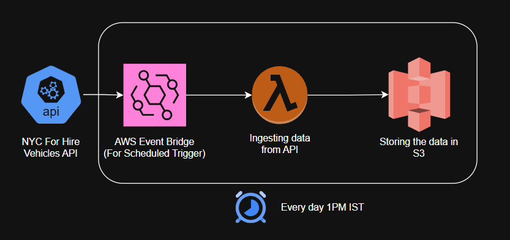

# nyc-fhv-data-quest

This project is designed to extract data from the NYC FHV API, store it in an S3 bucket, and then process it using AWS Lambda functions. The project is structured in a modular format, with separate files for different functionalities such as AWS client creation, data extraction, and data processing. The application is containerized using Docker and deployed to AWS Lambda using ECR repositories.

## Architecture Diagram


## Tools Used
1. **Python**: The primary programming language used for the application development.
2. **AWS Services**: S3 for data storage, Lambda for data processing, ECR for container registry, IAM for role management, EventBridge for scheduling, and Secrets Manager for secure storage of API credentials.
3. **Docker**: Used for containerizing the application to ensure consistency across different environments.
4. **SonarQube**: Used for code quality analysis and security vulnerability detection.
5. **GitHub Actions**: Used for continuous integration and deployment of the application.

## Permissions and Commands to run the application:
1. To manually build the infrastructure in the AWS account, run the following command in the terminal:

    ```
    pip install -r requirements.txt
    py -B -m development.deploy
    ```

2. To run the application and build the infrastructure, the user will be requiring the following permissions in the AWS account:
    - Permissions to create and manage Lambda functions.
    - Permissions to create and manage ECR repositories and images.
    - Permissions to create and manage IAM roles and policies.
    - Permissions to create and manage EventBridge rules.
    - Permissions to access AWS Secrets Manager to retrieve the API auth credentials.
    - Docker installed and configured with AWS CLI to authenticate with ECR repository and push the docker image.
    - API credentials to access the NYC FHV API.

3. Replace the values inside the config files with the appropriate values for your AWS account and API credentials before running the application.

4. Every time the changes are made to the codebase, sonarqube will be triggered to analyze the code quality and security vulnerabilities. Make sure to fix any issues reported by sonarqube before deploying the application. And once it is passed it will be automatically setup the infrastructure and deploy the application to AWS Lambda.

5. Secrets that will be required to be created in the Github Secrets for the application to work properly:
    - `AWS_ACCESS_KEY_ID`: Your AWS access key ID.
    - `AWS_SECRET_ACCESS_KEY`: Your AWS secret access key.
    - `SONAR_TOKEN`: Your SonarQube token for code analysis.

## Documentations
1. [AWS SDK for Python (Boto3)](https://docs.aws.amazon.com/boto3/latest/)
2. [NYC FHV Documentation](https://data.cityofnewyork.us/Transportation/For-Hire-Vehicles-FHV-Active/8wbx-tsch/about_data)
3. [Github Actions Documentation](https://docs.github.com/en/actions)
4. [SonarQube Documentation](https://docs.sonarqube.org/latest/)
5. [Docker Documentation](https://docs.docker.com/)